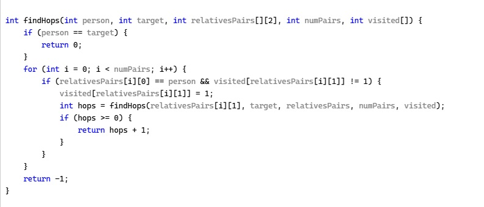

# AI Prompt Engineering Examples


## Overview

English is the new programming language.  
Here are simple examples of prompting ChatGPT to code in python and c to do things like demonstrate math concepts, or implement basic algorithms.
<br />
<br />
Prompt engineering criteria to produce useful code: 
* Control the context
    - Authoritative tone tells ChatGPT your level of expertise
    - Precise terminology tells ChatGPT your field of expertise 
    - Resolving ambiguity focuses ChatGPT on your objective 
* Use minimum necessary detail
    - Be precise
    - Be concise
    - Tell, don't ask
    - Specify user input
    - Omit implementation details
* Decide whether to iterate prompting, or manually edit the code for..
    - Bug fixes
    - Extensibility
    - Performance tuning 

<br />
In summary, know what you want, and ask for it.  This is a rule of life it takes some of us a long time to discover.  It's a way to achieve a happy life.


## 8th Grade Algebra

My Junior High Algebra teacher Mr. Martin said, "You can't see complex zeros on the graph."  I thought "what if x was complex?"

**ChatGPT prompt**
``` text
write a python console app to plot the surface of the absolute value of y, 
for the equation y = ax^2 + bx + c, where y and x are complex numbers, 
prompting the user for the scalar values of a, b and c. 
```

The graphic shows the result of running the code, after I fixed a minor bug

ChatGPT got one variable wrong in the python code, it used Z on line 21 and 26 I changed it to S (because it had already used Z on line 18)


## Trading Game

To demonstrate the Pareto effect, Jordan Petersen described a random trading game where one person ends up with all the money.  It's not a conspiracy; it's the nature of the game.

**ChatGPT prompt**
``` text
create a python console app with 40 players each starting with 10 dollars 
where the players having more than 0 dollars are grouped into pairs 
where each pair tosses a coin, and the loser pays the winner 1 dollar, 
keeping score of the players balances, plotting a graph of the players balances
```

If players are out when they reach 0 dollars, one player ends up with all the money.


## Graph Traversal

Can ChatGPT do it in python? Yes. It knew to use depth-first search for the first prompt and breadth-first search for the second. And it knew to prevent circular references that cause a stack overflow.

**ChatGPT prompt**
``` text
create a python console app
to determine the number of hops from PersonA to PersonB
by traversing a list of RelativesPairs
where each list element is defined as [Person, RelatedToPerson]
return -1 if PersonA is not related to PersonB
```


**ChatGPT prompt**
``` text
create a python console app
to determine the **minimum** number of hops from PersonA to PersonB
by traversing a list of RelativesPairs
where each list element is defined as [Person, RelatedToPerson]
return -1 if PersonA is not related to PersonB
```


And in C.

**ChatGPT prompt**
``` text
create a C console app to find the number of hops from John to Dave through the specified relatives pairs
where each pair is {person, relative}
given these values:
int john = 1;
int dave = 2;
int relativesPairs[][2] = {{1,3}, {4,5}, {4,1}, {5,2}, {5,1}, {3,4}, {3,5}, {1,5}};
```


**ChatGPT prompt**
``` text
create a C console app to find the **minimum** number of hops from John to Dave through the specified relatives pairs
where each pair is {person, relative}
given these values:
int john = 1;
int dave = 2;
int relativesPairs[][2] = {{1,3}, {4,5}, {4,1}, {5,2}, {5,1}, {3,4}, {3,5}, {1,5}};
```


I coded a main to run it.
``` shell
#include <iostream>
#include <vector>
#include <stack>
#include <unordered_set>
#include <unordered_map>
#include <stdio.h>
#include <stdbool.h>

int main() {
    int john = 1;
    int dave = 2;
    int relativesPairs[][2] = { {1,3}, {4,5}, {4,1}, {5,2}, {5,1}, {3,4}, {3,5}, {1,5} };
    int numPairs = sizeof(relativesPairs) / sizeof(relativesPairs[0]);
    bool visited[6] = { false }; // Assuming the persons are numbered from 1 to 5

    int minHops = findHops(john, dave, relativesPairs, numPairs, visited);
    if (minHops >= 0) {
        printf("Minimum number of hops from John to Dave: %d\n", minHops);
    }
    else {
        printf("John is not related to Dave.\n");
    }

    return 0;
}
```
